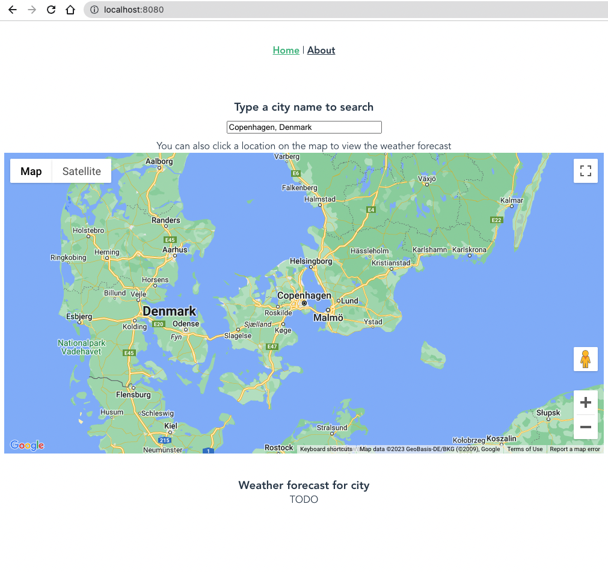

# Exerp Test

## Installation

### backend

    cd backend
    yarn
    yarn serve

### frontend

    cd frontend
    yarn
    yarn serve

## TODO:

- Please *copy* the project into your own github account and work on it there.
- Please *do not* fork the project, or make PRs to this repo.
- The location can be chosen either by searching for a city name, or by clicking on the map.
- Please make sure you check for errors and display them to the user. Also make sure you handle the loading state.
- Use TailwindCSS for styling.
- Improve the UI/UX of the app. You can write your own CSS. 
- Please make sure the app is responsive.

## Notes

- Please make sure you create a new branch for your work, and make a PR to main when you are done (in your own github repo).
- Please make sure the commits are atomic and meaningful.
- Please make sure the code is well formatted and easy to read.
- Bonus points for adding any new functionality you think would be useful. This should be in separate commits with a clear description of what you did.

- Bonus points for adding a docker-compose file to run the app.
- Bonus points for adding a CI/CD pipeline to run the tests and deploy the app.
- Bonus points for adding Cypress tests.
- All bonus points are optional

## Screenshot

